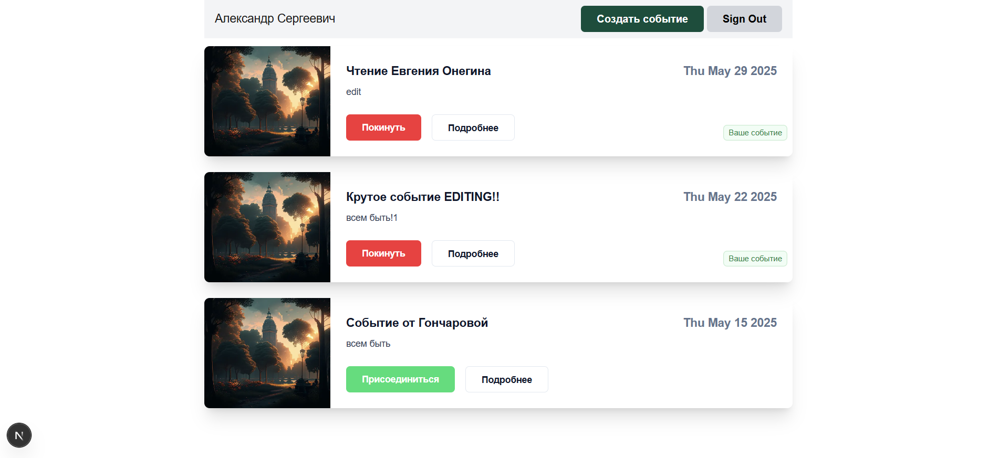
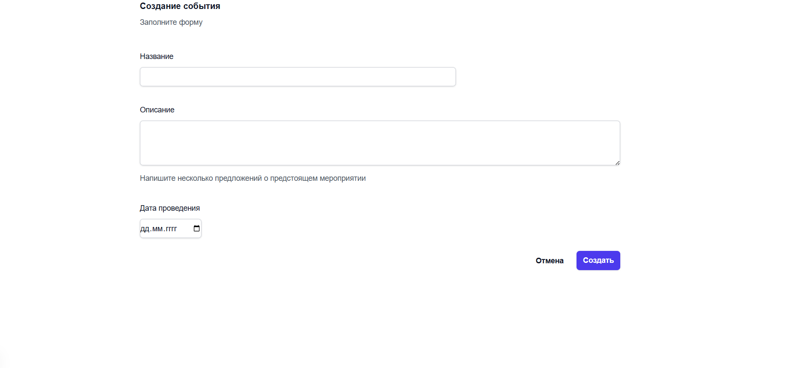

# Events App (учебный проект)

## Описание проекта
Приложение для организации и участия в событиях, построенное на современном стеке технологий. Позволяет пользователям создавать события, просматривать доступные мероприятия и присоединяться к ним.

## Технологический стек

### Frontend
- **Next.js** (App Router)
- **React** (хуки, серверные компоненты)
- **Type Script** (типизация)
- **Tailwind CSS** (стилизация)
- **React Hook Form** + **Zod** (формы и валидация)

### Backend
- **tRPC** (типизированные API-эндпоинты)
- **Prisma** (ORM для работы с базой данных)
- **SQLite** (база данных для разработки)
- **NextAuth** (аутентификация)

## Функционал
- Создание и редактирование событий
- Просмотр списка всех доступных событий
- Возможность участия/отмены участия в событиях
- Авторизация пользователей
- Валидация форм

## Установка и запуск

```bash
npm install
```
```bash
npm run dev
```
## Скриншоты интерфейса



